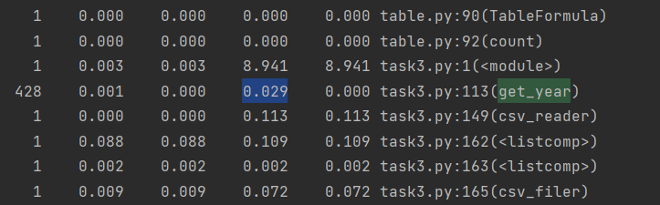
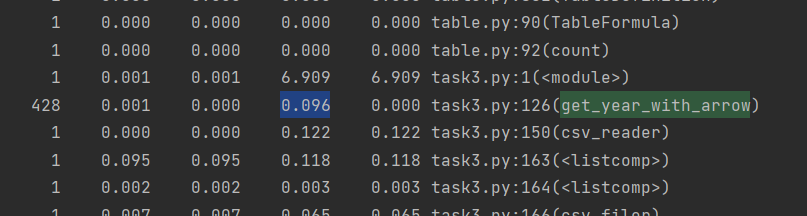
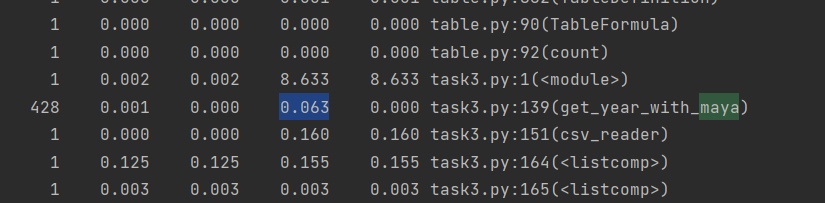
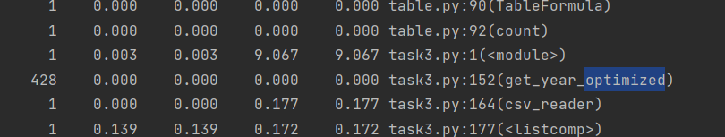

# Malevannyi
ТЕСТИРОВАНИЕ: 

ПРОФИЛИРОВАНИЕ:

Время выполнения прежнего метода обработки даты занимает 0.029 секунд

Теперь заменим прежний метод на метод, который использует библиотеку Arrow.
Результат по времени выполнения получился еще больше - 0.096 секунд

Теперь снова заменим метод, но теперь на метод с использованием
библиотеки Maya. Результат лучше, но все равно долго.

В конце концов, попробуем применить метод, которой просто берёт срез
из строки с датой. Время его выполнения существенно быстрее всех предыдущих - 0 секунд.
Оставим его в программе, а остальные методы закомментируем

